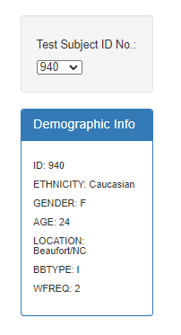
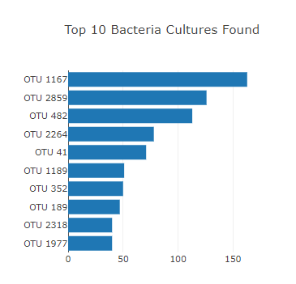
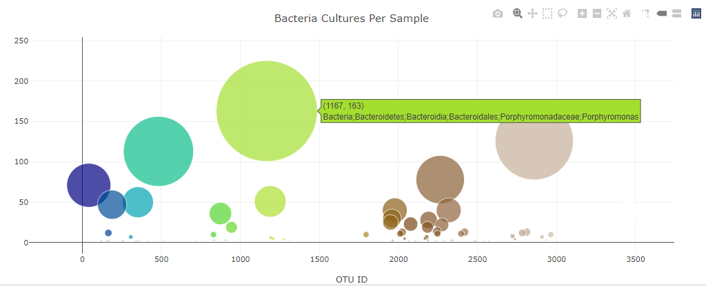
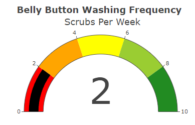
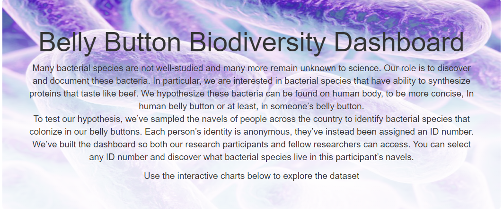
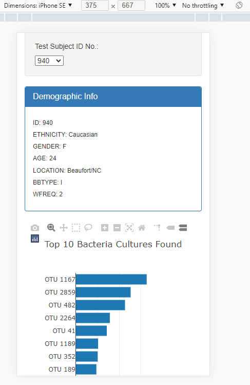

# bacteria

## Overview of the project

This project is created to explore bacterial species that have ability to synthesize proteins that taste like beef. There is a hypothesis that these bacteria can be found on human body, to be more concise, In human belly button or at least, in someone’s belly button. 

To test this hypothesis, navels of people across the country have been sampled to identify bacterial species that colonize in our belly buttons. Each person’s identity is anonymous, they’ve instead been assigned an ID number. The web page contains a dashboard that both research participants and researchers can access. Users select any ID number and discover what bacterial species live in this participant’s navels.

## Result

The web page contains 

- the demographic info of a chosen participant

- bar-chart with top-10 bacterial cultures found in their belly buttons
  

- the bubble chart showing bacteria cultures per sample

  

- the gauge chart with belly button washing frequency 

  

The jumbotron area contains an image, a header and  information about the project as a paragraph.

The page is mobile-responsive

## Summary

Users are able to get data about demographics and bacteria species of every  research participant. The web page is mobile responsive and updated with a jumbotron image and an information paragraph.